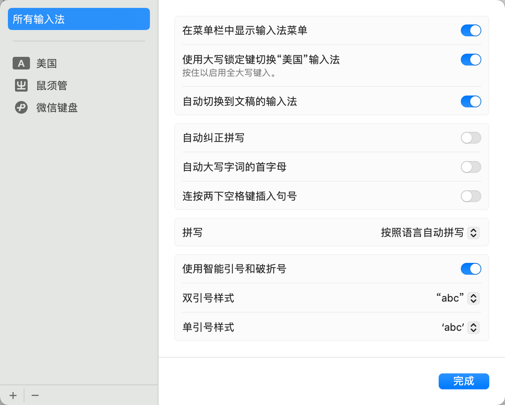

# Rime

鼠须管自用配置，基于 [rime-ice](https://github.com/iDvel/rime-ice) 定制的输入法，对程序员更友好。

## 特点

- 非入侵式修改。快速同步上游配置和词库，也可以单独更新词库。
- 精心配置的标点符号输入方案，兼顾编程、文档、聊天等场景。
- 更适合非全尺寸键盘的快捷键方案，双手移动距离更短。

## 使用

```shell
git clone --recursive https://github.com/jonymei/rime-loves-coder.git
cd rime-loves-coder
make
```

## 详细说明

### 方案选择

由于本人只使用小鹤双拼，所以小鹤双拼是开箱即用的，其他方案参照 commit history 进行手动调整。

使用之前，需要进行输入法的切换。找一个输入框，切换输入法到 Rime。推荐浏览器的搜索框，因为很多应用都会拦截快捷键，导致 Rime 配置的方案切换快捷键不能生效。按 F4，选择 「小鹤双拼」，其他使用预设的配置即可，包括中文、简体、半角。

后续就保持这个不变，无须关注处理。

英文输入更推荐使用系统自带的输入法。因为这个删不掉，同时存在多个英文输入法心智负担也更大。同时，系统自带的输入法还有根据应用自动切换输入法等贴心功能。



### 快捷键

- 向下翻页：`Tab` 或 `=`
- 向上翻页：`Shift + Tab` 或 `-`
- 选第 1 个：空格或 `1`
- 选第 2 个：`;` 或 `2`
- 选第 3 个：`'` 或 `3`
- 选第 3 个：`4`
- 以词定字：`[` 和 `]`

这样做的好处是，打字的时候，手部几乎不需要大范围移动，所有按键都能直达，尤其是 2 选和 3 选。

本方案是支持英文混合输入的，但有部分情况下，可能没有命中任何英文词典，所以需要手动输入直接上屏。

- 中文模式下英文上屏：`Enter`
- 中文模式下英文上屏并切换到英文输入法：`Capslock`

`Shift` 和 `Ctrl` 等修饰键均不参与处理。进一步降低心智负担。

### 标点符号

除了中文最常用的 `，。、；：` 之外，其他都使用英文标点直接上屏，这在写 Markdown 的时候最爽了，同理还有注释、正则表达式等场景。当然，我还配置了 `『』「」` 风格的引号，因为我觉得它们更适合中文。

原本那些符号可以通过 `Vbd` 模式输入，我也在 `custom_phrase_double.txt` 配置了自定义输入码，可以做个 fallback。

通过 Lua 可能有更优雅的 fallback 方案，有时间再看看了。

### 更新配置和词库

```shell
# 更新配置，当然一般不需要更新，除非 rime-ice 原作者有较大的改进
make full

# 更新全部词库
make

# 更新某一类词库
make cn
make en
make opencc
```

可以把 `cd xxx/Rime && make` 添加到 `crontab` 实现定时更新。

## 参考鸣谢

- [RIME | 中州韻輸入法引擎](https://rime.im/)
- [rime/plum: 東風破  *plum*: Rime configuration manager and input schema repository](https://github.com/rime/plum)
- [iDvel/rime-ice: Rime 配置：雾凇拼音 - 长期维护的简体词库](https://github.com/iDvel/rime-ice)
- [tshu-w/rime-conf: 中州韻輸入法個人配置](https://github.com/tshu-w/rime-conf)
